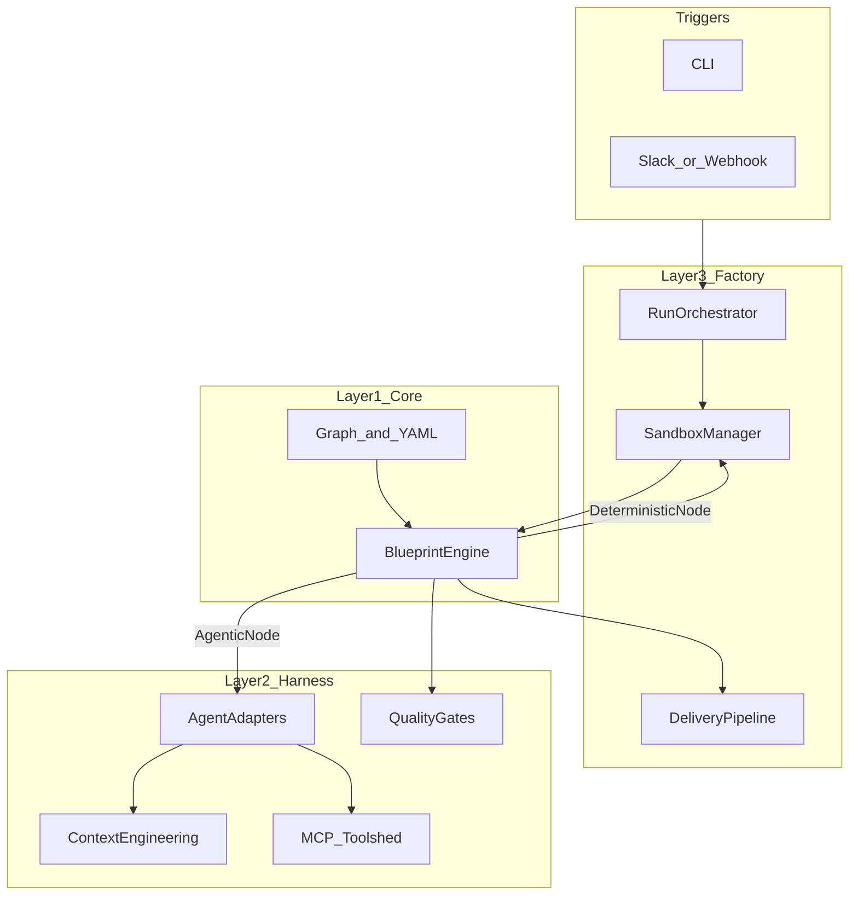

# Forge: Detailed Design

This document is the canonical architecture and design reference for **Forge**, an
open-source agent factory. It synthesizes research (Stripe Minions, harness
engineering practice, Anthropic long-running harness design, community harnesses)
into a three-layer system that is **agent-agnostic**, **deterministic where it
matters**, and **progressively capable** across versions.

For curated external links, see [references/references.md](../references/references.md).
For product requirements and MVP scope, see [prd-forge.md](prd-forge.md).

---

## 1. Vision and thesis

**The model is commodity. The harness is the product.**

Forge is the open-source harness that aims to let **any** AI coding agent operate
at **Stripe Minions–class autonomy**: unattended runs, isolated execution,
repeatable quality gates, and delivery as mergeable work—not a chat session you
must babysit.

Forge is a **three-layer system**:

1. **Blueprint Engine** — reliable orchestration (typed graph, deterministic +
   agentic nodes, gates).
2. **Harness** — intelligence (context engineering, quality gates, skills, evals,
   memory, MCP toolshed).
3. **Factory** — infrastructure (containers, triggers, parallel runs, delivery,
   observability).

Forge **does not replace** Claude Code, [Goose](https://github.com/block/goose),
Codex, or similar. It **wraps** them in the industrial harness that turns
interactive assistants into **autonomous factories**.

Design principle: **each layer is independently useful.**

- Layer 1 runs blueprints with a pluggable `AgentExecutor`.
- Layer 2 can be used as a harness service, library, or IDE-adjacent tooling
  without Layer 3.
- Layer 3 adds factory-scale isolation, triggers, and delivery.

---

## 2. Research synthesis

Patterns Forge explicitly borrows or reacts to:

| Source | What Forge takes from it |
|--------|---------------------------|
| **Stripe Minions** | Blueprints as hybrid state machines; isolated execution; curated tool subsets (~15/task); multi-tier quality gates; pragmatic retry caps (e.g. two CI rounds). |
| **OpenAI harness engineering** | `AGENTS.md` as table of contents; layered architecture; linter output as remediation; docs as system of record; hygiene agents. |
| **Anthropic (long-running harness)** | Planner / generator / evaluator separation; **sprint contracts** before coding; skeptical external evaluator; Playwright-style QA of running apps; **context resets vs compaction** tradeoffs; simplify harness as models improve. |
| **Boris Cherny / Claude Code practice** | Plan-first workflows; **failure-to-rule** (turn corrections into durable rules); skills for repeated workflows; parallel worktrees; verification as first-class. |
| **Everything Claude Code (ECC)** | Large skill libraries; hooks and cross-harness patterns; continuous learning and instincts; harness audit / quality commands. |
| **Superpowers** | Brainstorming-to-implementation discipline; TDD-oriented workflows. |
| **GSD** | Spec-driven development; context-isolating parallelism. |
| **BMAD** | Structured multi-agent / multi-phase product-to-code workflows (Forge encodes phases in blueprints rather than reimplementing BMAD wholesale). |
| **DeepAgents** | Planning primitives, filesystem tools, sub-agents, summarization—**inspiration** for harness capabilities; Forge **wraps** agents rather than replacing them. |
| **PocketFlow** | **Graph as core abstraction**—blueprints are explicit graphs with typed nodes. See also the [PocketFlow design patterns](https://the-pocket.github.io/PocketFlow/design_pattern/) catalog (Agent, Workflow, RAG, Map Reduce, Multi-Agents). |
| **ChatDev (DevAll 2.0)** | YAML-driven multi-agent workflows, Docker, SDK—closest open-source comparable to blueprint-first orchestration; Forge differs via **three-layer independence**, **agent-agnostic** adapters, and **deterministic gates** as first-class nodes ([ChatDev](https://github.com/OpenBMB/ChatDev)). |
| **Paude** | Container isolation, network posture, git-centric I/O for agent runs. |
| **cc-connect** | Messaging bridges (Slack, Discord, Telegram, etc.) as trigger surfaces. |
| **Tessl / eval-driven skills** | Skills as versioned artifacts with evaluation lifecycle. |
| **IBM-style finding (cited in planning)** | Combine LLM judgment with **deterministic** checks for high catch rates—Forge encodes this as gates + linters/tests. |
| **Claude Code (production agent)** | Role-based tool allowlists per agent role; concurrent vs serial tool batching with `isConcurrencySafe` metadata; layered permission model (deny > ask > allow with source precedence); typed hooks pipeline (27 events); coordinator as prompt composition not separate runtime; file-backed agent mailboxes for multi-agent communication; PID-based memory consolidation locks with gate ordering; structured context assembly for prompt caching; streaming tool execution. See [aicurs patterns](../references/aicurs-patterns.md). |

---

## 3. Architecture overview

### 3.1 Three layers

```text
Layer 3: Forge Factory (Go)     — Infrastructure: sandboxes, triggers, orchestration, delivery
Layer 2: Forge Harness (TS)     — Intelligence: adapters, context, quality, skills, memory, toolshed
Layer 1: Forge Core (Go)        — Engine: blueprint graph, typed nodes, execution loop
```

### 3.2 Layer independence

- **Without Layer 3**: Run the engine locally or in CI; harness provides `AgentExecutor`.
- **Without full Layer 2**: Use a mock or minimal executor for tests and dry-runs.
- **With all layers**: `forge run` from CLI or chat triggers an isolated run that
  produces a PR.

### 3.3 High-level data flow



### 3.4 Ecosystem integration

Forge **composes** the existing ecosystem instead of replacing it: messaging
bridges, container isolation, doc retrieval, browser QA, and MCP servers sit
**outside** the core engine and are orchestrated by the harness and factory.

```text
┌──────────────────────────────────────────────────┐
│                  EXISTING TOOLS                   │
│  cc-connect (messaging bridge, Go)                │
│  Paude (container isolation)                      │
│  Context7 (documentation context)                 │
│  Playwright MCP (browser / app QA)                │
│  GitHub MCP, Slack MCP, internal Toolshed, etc.   │
└──────────────────┬───────────────────────────────┘
                   │ wraps / orchestrates
┌──────────────────▼───────────────────────────────┐
│                     FORGE                         │
│  Blueprint Engine + Harness + Factory             │
└──────────────────┬───────────────────────────────┘
                   │ wraps
┌──────────────────▼───────────────────────────────┐
│                  AGENT ENGINES                     │
│  Claude Code | Goose | Codex | Gemini | any MCP    │
└──────────────────────────────────────────────────┘
```

---

## 4. Layer 1: Forge Core (Blueprint Engine)

### 4.1 Responsibility

**Language:** Go. **Size target:** on the order of ~1000 lines for the core engine
(excluding tests and CLI).

**Concept:** A **typed state machine** that interleaves **deterministic** and
**agentic** nodes—Stripe’s hybrid blueprint model, with a graph abstraction
inspired by minimal graph frameworks such as [PocketFlow](https://github.com/The-Pocket/PocketFlow)
and its [design pattern catalog](https://the-pocket.github.io/PocketFlow/design_pattern/).

Execute **versioned YAML blueprints** (and, in future, **composed** blueprints) as a
**directed graph** with **conditional edges** for gates. Enforce **iteration
limits** so gate loops cannot run unbounded. Provide a stable **`AgentExecutor`**
seam for Layer 2.

Declarative definitions are primarily **YAML**; **TypeScript** (or codegen) may
describe composed workflows, skill bindings, or validation schemas in the harness
as the implementation matures.

### 4.2 Node types

**Implemented today (v0.1 engine):**

| Type | Role | Determinism |
|------|------|-------------|
| **Agentic** | LLM agent step (prompt + config); uses `AgentExecutor` | Non-deterministic |
| **Deterministic** | Shell command (e.g. lint, test, git) | Deterministic (modulo environment) |
| **Gate** | Routes pass/fail based on a prior node’s `NodeResult` | Deterministic routing |

**Planned extensions:**

| Type | Role |
|------|------|
| **Eval** | Separate evaluator agent / grader (Anthropic-style separation) |
| **Human** | Pause for approval or input |

**Examples (intent):**

- **Agentic:** “Implement the feature”, “Fix test failures”, “Address lint output.”
- **Deterministic:** “Run linters”, “Run selective tests”, “Git commit”, “Open PR
  via `gh`”, “Push to trigger CI.”
- **Gate:** “Did lint pass?”, “Did tests pass?”, “Quality score above threshold?”
- **Human:** “Approve PR”, “Provide clarification”, “Escalate after `fail_final`.”
- **Eval:** “QA the running app (e.g. Playwright)”, “Grade code on criteria with
  hard thresholds.”

### 4.3 Graph rules (summary)

- Blueprint has a **start** node id.
- Edges carry optional **conditions**: `pass`, `fail`, or unconditional (`""`).
- **Gate** nodes reference a `check_node` whose `NodeResult` drives routing.
- Validator ensures reachability from start; engine enforces **max iterations**
  per run to prevent infinite gate loops.

### 4.4 Key types (Go)

`AgentExecutor` is the integration point for the harness:

```go
type AgentExecutor interface {
	Execute(ctx context.Context, prompt string, config map[string]interface{}) (string, error)
}
```

### 4.5 Implementation layout (current)

- `core/blueprint/types.go` — node types, `RunState`, `AgentExecutor`
- `core/blueprint/graph.go` — graph structure and validation
- `core/blueprint/node.go` — node implementations
- `core/blueprint/engine.go` — execution loop
- `core/blueprint/yaml.go` — parse YAML → graph

Built-in YAML lives under `blueprints/` and is embedded for CLI use (`embed.go`).

### 4.6 Target blueprint schema (illustrative — not all fields exist in v0.1 YAML)

The engine today uses a **smaller** schema (`type`, `config.prompt` / `config.command` /
`config.check_node`, `edges` with `condition`). The following shows the **target**
shape: skills, explicit gate retry caps, eval thresholds, and human escalation.
It is the north star for parser and engine evolution.

```yaml
name: standard-implementation
description: "Standard task implementation with quality gates"
version: "1.0"
hooks:
  - id: metrics
    events: [HookPreNodeExec, HookPostNodeExec]
    # Target: register plugin or builtin handler (exact shape TBD)
nodes:
  plan:
    type: agentic
    prompt_skill: "planning/decompose-task"
    output: plan.md
    concurrency_safe: false
    allowed_tools: [read, grep, glob]
    max_retries: 2
  implement:
    type: agentic
    prompt_skill: "coding/implement"
    input: plan.md
    tools: [read, write, edit, shell, grep]
    concurrency_safe: false
    allowed_tools: [read, write, edit, shell, grep]
    max_retries: 3
  lint:
    type: deterministic
    command: "forge run-linters"
    concurrency_safe: true
  lint_gate:
    type: gate
    condition: "lint.exit_code == 0"
    on_fail: fix_lint
    max_retries: 2
  fix_lint:
    type: agentic
    prompt: "Fix the following lint errors: {{lint.stderr}}"
    next: lint
    max_retries: 2
    concurrency_safe: false
  test:
    type: deterministic
    command: "forge run-tests --selective"
    concurrency_safe: true
  test_gate:
    type: gate
    condition: "test.exit_code == 0"
    on_fail: fix_tests
    max_retries: 2   # Stripe-style cap; map to engine max iterations + CI rounds
  fix_tests:
    type: agentic
    prompt: "Fix the following test failures: {{test.stderr}}"
    next: test
    max_retries: 2
    concurrency_safe: false
  evaluate:
    type: eval
    evaluator_skill: "quality/code-review"
    criteria: [correctness, security, maintainability, test_coverage]
    threshold: 0.8
    max_retries: 2
    concurrency_safe: false
  commit:
    type: deterministic
    command: "git add -A && git commit -m '{{task.description}}'"
    concurrency_safe: false
    max_retries: 1
  create_pr:
    type: deterministic
    command: "gh pr create --title '{{task.title}}' --body '{{task.summary}}'"
    concurrency_safe: false
    max_retries: 1
edges:
  - plan -> implement
  - implement -> lint
  - lint -> lint_gate
  - lint_gate[pass] -> test
  - test -> test_gate
  - test_gate[pass] -> evaluate
  - evaluate[pass] -> commit
  - commit -> create_pr
  - evaluate[fail] -> implement
  - test_gate[fail_final] -> escalate_human
  - lint_gate[fail_final] -> escalate_human
```

### 4.7 Composable blueprints

Blueprints should **compose** smaller verified graphs—for example a full factory run
that chains context loading, sprint contract negotiation, implementation, and
delivery:

```yaml
name: factory-run
compose:
  - blueprint: context-hydration
  - blueprint: sprint-contract
  - blueprint: standard-implementation
  - blueprint: delivery
```

Implementation note: composition may expand to a flat graph at load time, with
namespace prefixes for node ids to avoid collisions. `core/blueprint/compose.go`
is the planned home for this logic.

### 4.8 Engine hooks

Layer 1 exposes a **typed hooks pipeline** so orgs and the harness can observe and
influence runs without forking the engine. The design is inspired by the aicurs
hook pipeline (28 events with structured JSON responses); Forge starts with a
smaller, graph-centric set aligned to blueprint execution. See
[aicurs patterns](../references/aicurs-patterns.md).

**Interface (target):**

```go
type EngineHook interface {
	OnEvent(ctx context.Context, event HookEvent, data map[string]interface{}) HookResult
}
```

**Event types (initial set):** `HookRunStart`, `HookPreNodeExec`, `HookPostNodeExec`,
`HookPreEdgeTraversal`, `HookGateEvaluated`, `HookRunComplete`, `HookRunError`.

**Hook result:**

```go
type HookResult struct {
	Continue      bool
	ModifyInput   map[string]interface{}
	InjectContext string
	Error         error
}
```

**Semantics:** hooks register via `Engine.RegisterHook` and run in **registration
order** for each event. The first hook that returns `Continue: false` **aborts** the
run (or the current branch, depending on policy) after surfacing `Error`. `ModifyInput`
and `InjectContext` let hooks adjust the next node’s inputs or prepend context for
the executor without replacing the whole prompt stack. This enables permissions,
structured logging, metrics, and custom gates as **composable** hooks rather than
hard-coded engine branches.

### 4.9 Concurrent node execution

When the scheduler resolves **multiple next nodes** (siblings after a fan-out or
parallel edge set), the engine may execute them concurrently if every candidate
node is explicitly marked safe. This mirrors aicurs **`partitionToolCalls`**:
merge work into parallel batches only when metadata says it is safe; otherwise run
serially. See [aicurs patterns](../references/aicurs-patterns.md).

**Node interface extension (target):**

```go
type Node interface {
	// ... existing methods ...
	IsConcurrencySafe() bool // default false — fail closed
}
```

**Rules:**

- If `resolveNextNode` returns multiple nodes and **all** report `IsConcurrencySafe() == true`,
  execute the batch with a bounded **`errgroup`** (or equivalent), capped by
  `Engine.MaxConcurrency` (default **10**, overridable via environment variable).
- **RunState** updates from each goroutine are **collected** during the batch and
  **applied in declaration order** after the batch completes, preserving deterministic
  ordering of side effects visible to subsequent nodes.
- **DeterministicNode:** safe **by default** (read-only / idempotent commands as
  configured); **GateNode:** **never** safe (routing must be sequential); **AgenticNode:**
  **configurable** via YAML (`concurrency_safe: true|false`).

### 4.10 Permission checks

Before each node runs—**after** hooks that may inject context but **before** the
executor or shell runs—the engine asks a **permission checker** for a decision.
Model follows aicurs **layered permission pipeline** (deny > ask > tool-specific >
bypass > allow), simplified here to three outcomes. See
[aicurs patterns](../references/aicurs-patterns.md).

**Interface (target):**

```go
type PermissionChecker interface {
	Check(ctx context.Context, n Node, rs *RunState) (PermissionDecision, error)
}

type PermissionDecision int

const (
	Allow PermissionDecision = iota
	Deny
	Ask
)
```

**Semantics:** `Deny` blocks execution; `Allow` proceeds; `Ask` requests human or
policy escalation. In **headless / autonomous** mode, `Ask` maps to **`Deny`**
automatically so runs never stall waiting for input. The default implementation
**`TrustedSourceChecker`** always returns `Allow` when the blueprint is loaded from
trusted paths, preserving **current v0.1 behavior** until orgs plug in stricter
checkers.

---

## 5. Layer 2: Forge Harness (Intelligence)

### 5.1 Responsibility

**Language:** TypeScript.

**Form factor:** both a **library** consumed by Layer 3 and an optional **CLI /
plugin** surface inside Cursor / Claude Code (same assets, different packaging).

Make agent runs **context-aware**, **tool-efficient**, and **quality-bounded**
without hard-coding a single vendor agent.

### 5.2 Agent Adapter Protocol

Adapters normalize different runners behind one contract. **MVP path:** a gRPC
service in TS implementing the contract the Go engine expects, with **Echo** (tests)
and **Claude Code** (headless CLI) adapters first.

**Target TypeScript interface** (streaming-friendly; exact shapes will evolve with
proto definitions):

```typescript
interface AgentAdapter {
  name: string;
  execute(request: AgentRequest): AsyncIterable<AgentEvent>;
  getCapabilities(): AgentCapabilities;
  interrupt(): Promise<void>;
}

interface AgentRequest {
  prompt: string;
  tools: Tool[];
  context: ContextBundle;
  constraints: ExecutionConstraints;
}

// Built-in adapters (target):
// - ClaudeCodeAdapter (headless `claude` CLI)
// - GooseAdapter
// - CodexAdapter
// - DirectLLMAdapter (raw API)
// - CursorAdapter (Cursor CLI / agent API as available)
```

The Go side today uses a simpler **`AgentExecutor`** (`Execute(ctx, prompt, config)`);
the TS protocol above is the harness-facing richness goal (events, tools, interrupt).

### 5.3 Context engineering

OpenAI-style lesson: **`AGENTS.md` is a table of contents**, not an encyclopedia.
Context is **progressively disclosed**; everything else is loaded on demand.

**Progressive disclosure levels (target):**

| Level | Source | Role |
|-------|--------|------|
| 0 | `AGENTS.md` (~100 lines) | TOC and non-negotiables |
| 1 | `ARCHITECTURE.md`, dependency map | System shape |
| 2 | `docs/<domain>/` | Domain-specific depth |
| 3 | `.forge/rules/` per directory | Scoped rules as the agent works in tree |
| 4 | Task-selected snippets | Retrieved for this run only |

**Context budget manager:** track approximate token usage; prefer task-specific
context over generic rules when the budget is tight.

**Directory-scoped rules:** co-locate `.forge/rules/` with code (Stripe-style
scoped hydration) so the agent does not carry global noise.

**Context selection algorithm (target):** from the task description + touched paths,
infer modules and directories; pull levels 0–3 accordingly; attach level 4 from
retrieval or blueprint inputs. **Tooling:** aim for **~15 relevant MCP tools** per
task—not hundreds ([Everything Claude Code](https://github.com/affaan-m/everything-claude-code)
documents the same “too many MCPs shrink effective context” failure mode).

**Prompt composition stack:** the composed system prompt follows a strict priority
order so higher-priority content is never truncated in favor of lower-priority
filler:

1. **Override** — org-level or run-level mandatory instructions (security, compliance).
2. **Coordinator / supervisor** — if a blueprint node has `role: coordinator`, its
   orchestration prompt replaces (or prepends to) the agent-level prompt.
3. **Agent-specific** — adapter-level system prompt from the `AgentAdapter`.
4. **Project rules** — `AGENTS.md` + `.forge/rules/` (levels 0–3 above).
5. **Default system prompt** — Forge's built-in baseline.

When the total exceeds the context budget, items are dropped from the bottom of
the stack. This ordering ensures safety and org policy are never sacrificed for
generic defaults.

**Structured context assembly (target):** instead of a single flat prompt string,
the harness assembles **`ExecutionContext`** from **separate blobs**—for example
**system context** (git branch, `git status`, recent commits) and **user context**
(project instructions, `AGENTS.md`, task payload). Those blobs are joined in a
**stable order** and used as a **prompt cache key prefix** so repeated runs with
the same repo state hit cache efficiently. Independent sources (git metadata,
filesystem reads, MCP fetches) can be loaded **in parallel** (`Promise.all`-style
in TS; bounded worker pool in factory) before the adapter call. This pattern is
drawn from aicurs-style context splitting for caching; see
[aicurs patterns](../references/aicurs-patterns.md).

### 5.4 Quality gate system (Anthropic-style)

Core insight from [Anthropic’s long-running harness post](https://www.anthropic.com/engineering/harness-design-long-running-apps):
agents are **weak at honest self-evaluation**; **separating generator and
evaluator** is a strong lever (see also GAN-inspired loops in that article).

- **Deterministic gates** in Layer 1 (lint/test) remain the cheap first line of
  defense.
- **Sprint contracts:** before large implementation chunks, generator and
  evaluator agree in writing on **done** and **verification** (file-based
  handoff is fine).
- **Evaluator agent:** separate instance, **skeptical** system prompt, **few-shot
  calibration** to team taste, optional **Playwright MCP** for running apps.
- **Grading criteria (configurable):** correctness, security, maintainability,
  test coverage, functionality (UI exercised when applicable).
- **Hard thresholds:** failing any criterion fails the eval node; feed structured
  feedback back to implementation.
- **Retry caps:** Stripe-style **two-round** (or configurable) limits before
  **HumanNode** / escalation—bound cost and diminishing returns.

### 5.5 Skill registry

Skills are **versioned knowledge artifacts** with an **eval-driven lifecycle**
(Tessl / Skill Creator direction).

**Illustrative skill layout** (ecosystem-compatible `SKILL.md`):

```markdown
# skills/coding/implement-feature/SKILL.md
---
name: implement-feature
version: 1.2.0
description: "Implement a feature from a plan document"
eval_score: 0.87
tags: [coding, implementation]
---
# Implementation Skill
Given a plan document, implement the feature...
```

**Lifecycle:** Create → **Eval** (scenarios + assertions) → Improve → Benchmark
(A/B vs baseline) → Publish (version + changelog).

**Specification alignment:** Forge’s skill layout follows the Anthropic Agent Skills
specification described in
[The Complete Guide to Building Skills for Claude (PDF)](../references/The-Complete-Guide-to-Building-Skill-for-Claude_260330_185835.pdf):
`SKILL.md` (required) plus optional `scripts/`, `references/`, and `assets/`.
Skills use **three-level progressive disclosure** (YAML frontmatter → `SKILL.md` body →
linked bundled files). The eval-driven lifecycle in that guide (trigger tests,
functional tests, performance comparison) maps to Forge’s **testable artifact**
requirement for skills.

**Self-improvement:** after runs, extract patterns from success/failure; **promote**
candidates to skills only after evals pass (ECC “instincts” semantics, but gated
by validation).

### 5.6 Memory and learning

- **Session capture:** record task, context snapshot ids, agent trace, outcomes;
  compress for storage (claude-mem-style).
- **Failure-to-rule:** on failure, derive a **new rule** under the right
  `.forge/rules/` path so the same mistake is less likely next time.
- **Cross-session knowledge:** prefer **git-native** artifacts (OpenAI “repo as
  system of record”) so clones inherit org learning without a proprietary DB.
- **Doc-gardening:** periodic pass to flag or fix stale docs vs code (optional
  automated PRs).

### 5.7 Toolshed (MCP)

- **Registry:** catalog tools with **capabilities**, estimated **token cost** /
  description size, and **reliability** or usage stats where available.
- **Task-scoped curation:** select a small allowlist per task using task type,
  target directories, and historical effectiveness (Stripe “~15 tools” lesson).
- **Integration:** MCP via standard servers; align with LangChain [Deep Agents](https://github.com/langchain-ai/deepagents)
patterns (tool boundaries in the sandbox, not model honor system).
- **Tool pool assembly:** a pure function `assembleToolPool(permissionContext,
  extensionTools)` merges built-in tools with MCP/plugin tools. Deny rules filter
  first, then deduplication (built-ins win on name clash), then stable alphabetical
  sort so prompt cache prefixes remain consistent across turns.
- **Deferred tool loading:** when tool definitions exceed a configurable threshold
  of the model context window (e.g. 15%), defer lower-priority tools behind a
  **tool search** mechanism rather than inlining all definitions. Keeps the prompt
  lean while preserving access to the full catalog on demand.
- **Read/mutate partitioning:** classify tool calls as **read-only** (file reads,
  grep, glob) vs **mutating** (writes, shell). Batch read-only calls for concurrent
  execution; enforce serial execution for mutating calls. Applies to both MCP tool
  invocations and `DeterministicNode` shell commands.

**MCP transport abstraction (target):** the toolshed treats MCP as a **multi-transport**
capability—**stdio**, **SSE**, **streamable HTTP**, **WebSocket**, and **in-process SDK**
adapters normalize to one client surface. Tool names are **normalized with a server
prefix** (e.g. `server__tool`) to avoid collisions across servers. Every call uses
**strict timeouts** (`Promise.race` / `AbortSignal` in TS; `context.WithTimeout` on
the Go factory side when proxying) so hung servers cannot wedge a run. **Progress
and partial results** surface as first-class events for streaming UIs. **OAuth-based**
MCP servers get explicit **auth refresh** handling so tokens renew without manual
restarts. See [aicurs patterns](../references/aicurs-patterns.md).

### 5.8 Branch and subagent isolation

When the engine forks a subgraph or the harness spawns a sub-agent, mutable state
must be isolated while immutable state is shared for efficiency:

- **Isolated per branch:** abort/cancel scope, token budget, `RunState` results,
  permission mode (background workers default to non-interactive).
- **Shared across branches:** file cache, content replacement IDs (for prompt cache
  stability), tool registry snapshot.
- **Task registry path:** long-lived background branches maintain a reference back
  to the root `RunState` so their lifecycle events (completion, failure) propagate
  to the top-level orchestrator even after context compaction.

This mirrors the `createSubagentContext` pattern observed in production agent CLIs
and prevents runaway branches from corrupting the parent run.

### 5.9 Subagent context patterns

Subagents inherit parent context through **fork** semantics that stay **API-safe**:
replay parent messages but **drop incomplete tool pairs** (assistant `tool_use`
without matching `tool_result`) so downstream models never see dangling invocations.
**Permission overlay** is layered: each agent gets an effective `GetState()` view
(role-based allow/deny) rather than mutating a single global config. **Per-type
context trimming** reduces noise—for example skip **git status** for explore-only
agents, strip **claudeMd** / project-instruction blocks for plan-only agents.
**Isolated transcript subdirectories** per agent preserve an audit trail without
cross-contaminating the parent log. **defer-style cleanup** on subagent teardown
releases MCP connections, shell child processes, hook registrations, and file
cache entries in a defined order. Patterns align with aicurs subagent and permission
plumbing; see [aicurs patterns](../references/aicurs-patterns.md).

### 5.10 Bridge to Layer 1

- **Protobuf + gRPC** service (e.g. `proto/forge/v1/agent.proto`) with a thin Go
  client implementing `AgentExecutor`.

**Status:** specified in `.cursor/plans/layer_2_harness_mvp_07ee3081.plan.md`;
not yet merged as top-level `harness/` in this repo snapshot.

---

## 6. Layer 3: Forge Factory (Infrastructure)

### 6.1 Sandbox manager

Inspired by Stripe **Devboxes** and validated by **Paude**-style isolation:

- **Docker/Podman** per run; disposable **cattle** posture.
- **Warm pool** (post-MVP): pre-cloned repos, warmed caches—target **under 10s** ready
  (design goal; v0.1 may use cold start only).
- **Network filtering:** allow registries and git remotes; **deny** arbitrary
  exfil endpoints by default (policy-driven).
- **Git-based I/O:** agent commits inside the container; Forge syncs branches /
  artifacts for review.
- **Resource limits:** CPU, memory, wall-clock **timeout** per run.

### 6.2 Trigger system

Leverage **cc-connect**-style provenance for chat bridges:

- **Slack / Discord / Telegram:** emoji, `@forge`, thread as run log.
- **CLI:** `forge run "Fix the failing test in payments/"`.
- **Webhook API:** CI or custom automation POSTs a run request.
- **GitHub Issues / PR comments:** `@forge` invocations.
- **Cron / scheduled:** e.g. morning triage of failing tests → PRs.

### 6.3 Run orchestrator

- **Parallel runs:** many tasks at once; **one container (or slot) per run**.
- **Queues** when the warm pool or quota is exhausted.
- **Lifecycle:** create → allocate sandbox → execute blueprint → delivery → teardown.
- **Cost tracking:** tokens, container minutes, total **$** estimate per run.
- **Retry / escalation:** retry with different params; route to human on
  `fail_final` or policy.

### 6.4 Delivery pipeline

- **PR creation** with templates, labels, linked issues.
- **CI integration:** trigger pipelines; ingest results into gate logic.
- **Human review queue:** sort by confidence / risk (dashboard TBD).
- **Auto-merge** only when policy + gates + CI allow (high-confidence path).

### 6.5 Observability

- **Run tracing:** every node, agent turn, and tool call correlated by **run id**.
- **Token analytics:** cost by blueprint, node, skill, adapter.
- **Success rate:** mergeable PR rate, gate failure taxonomy.
- **Harness health:** skill eval scores; which rules prevented repeat failures.
- **Transcript topology:** parallel tool/node executions produce a **DAG** in the
  event log, not a linear sequence. Event correlation and run replay must handle
  orphaned siblings from interrupted parallel branches and reconstruct the true
  execution tree from parent pointers.

**Status:** planned; no top-level `factory/` package in this repo snapshot.

### 6.6 Task lifecycle

Layer 3 maintains a **typed task registry** with **uniform state transitions**
(create → running → succeeded | failed | cancelled, etc.). **Task types** map to
blueprint execution modes: **`local`** (in-process engine), **`sandbox`** (Docker /
Podman isolation), **`remote`** (distributed worker). Long-running work writes
**disk-backed output** (logs, artifacts, partial results) so restarts and polling
do not rely on RAM alone. Tasks that exceed a **wall-clock threshold** may be
**promoted to background** execution with **async polling** and completion
callbacks. **Notification hooks** fire on key transitions (e.g. `TaskCreated`,
`TaskCompleted`) for webhooks, Slack, or internal queues. See
[aicurs patterns](../references/aicurs-patterns.md) for precedent on task typing
and background promotion.

### 6.7 Agent communication

Multi-agent factory runs use **file-backed JSON mailboxes** as the **local-first**
default for inter-agent messages (durable, easy to inspect). The abstraction is
**pluggable**: **file** (default), **Redis** (scale-out), or **message queue**
(enterprise) backends share one interface. **Stable agent names** within a team
or run enable **deterministic addressing**. Messages use a **`TeammateMessage`**
shape: **from**, **text**, **timestamp**, **read** status (and optional metadata).
This complements Layer 1’s graph edges with **ad hoc** coordination when
blueprints allow swarm-style roles.

### 6.8 Feature gates

**Compile-time:** Go **`//go:build`** tags strip internal or experimental factory
features from public binaries. **Runtime:** environment variables and config
files toggle features without recompilation. **Blueprint-level:** optional
**`feature_gate`** on nodes (or edges) **includes or excludes** subgraphs when a
named gate is on—useful for preview channels and org policy. Together these match
the layered “ship fast but control blast radius” approach seen in production agent
shipping; see [aicurs patterns](../references/aicurs-patterns.md).

---

## 7. Key differentiators

| Compared to | Forge’s position |
|-------------|------------------|
| **Stripe Minions** | **Open source**, **agent-agnostic**, **self-improving** (skills, rules, evals). Stripe’s harness is proprietary and tied to their **Goose fork**; Forge wraps **any** engine. Sources: [Stripe Dev Blog](https://stripe.dev/blog/minions-stripes-one-shot-end-to-end-coding-agents), [ByteByteGo summary](https://blog.bytebytego.com/p/how-stripes-minions-ship-1300-prs). |
| **ECC / Superpowers / BMAD / GSD** | Those are primarily **config packs and methodology** ([ECC](https://github.com/affaan-m/everything-claude-code), [Superpowers](https://github.com/obra/superpowers), [BMAD](https://github.com/bmad-code-org/BMAD-METHOD), [GSD](https://github.com/gsd-build/get-shit-done)). ECC ships **many skills** but not a first-class **orchestration engine**; Superpowers and BMAD excel at **phase discipline** but not **execution isolation** and **deterministic gates** as the core product. **Forge is the runtime**: blueprint state machine + factory. |
| **DeepAgents** | [DeepAgents](https://github.com/langchain-ai/deepagents) **is** a coding agent / harness runtime (LangGraph). Forge **wraps** Claude Code, Goose, Codex, etc.—it competes on **factory** and **policy**, not on replacing those CLIs. |
| **Paude** | Paude **isolates** agents in containers. Forge **orchestrates** what happens **inside**: blueprints, quality gates, skill-driven context, delivery. |
| **cc-connect** | cc-connect **bridges** agents to messaging. Forge adds **intelligence between message and execution** (context, tools, evals, graphs). |
| **ChatDev (DevAll 2.0)** | [ChatDev](https://github.com/OpenBMB/ChatDev) provides YAML workflows and multi-agent roles. Forge differentiates with **three-layer independence** (engine, harness, factory as separable products), **agent-agnostic wrapping** (Claude Code, Goose, Codex, etc. vs ChatDev’s built-in agent stack), and **deterministic gates** as first-class quality enforcement in the graph. |
| **PocketFlow** | [PocketFlow](https://github.com/The-Pocket/PocketFlow) is a **~100-line graph** core; see [Design Patterns](https://the-pocket.github.io/PocketFlow/design_pattern/) for named workflow idioms. Forge’s **Blueprint Engine** is a **product graph**: Stripe-style **hybrid deterministic + agentic** nodes, plus **Harness** and **Factory** layers on top. |
| **Squad** | [Squad](https://github.com/bradygaster/squad) models **persistent agent teams** in-repo; Forge complements that pattern with a **portable execution engine** and **sandboxed factory**—teams or roles can be projected onto blueprint nodes and harness adapters. |

---

## 8. Blueprint examples

### 8.1 Flow: `standard-implementation` (built-in)

```text
plan → implement → lint → lint_gate ⇄ implement
                 → test → test_gate ⇄ implement
                 → commit
```

### 8.2 Snippet: `standard-implementation.yaml` (abridged)

See full file at [`blueprints/standard-implementation.yaml`](../blueprints/standard-implementation.yaml).

Key ideas:

- **Agentic** nodes `plan` and `implement` carry prompts.
- **Deterministic** `lint` / `test` call repo commands (e.g. `make lint`).
- **Gates** `lint_gate` / `test_gate` retry `implement` on failure.

### 8.3 Flow: `bug-fix` (built-in)

```text
reproduce → fix → test → test_gate ⇄ fix → commit
```

Full file: [`blueprints/bug-fix.yaml`](../blueprints/bug-fix.yaml).

### 8.4 Target blueprint (post-MVP)

```text
plan → implement → lint → lint_gate → test → test_gate → evaluate → commit → create_pr
```

`evaluate` maps to **Eval** nodes / harness evaluator; `create_pr` maps to
delivery automation in Layer 3.

---

## 9. MVP roadmap

### 9.1 v0.1 — thin vertical slice

**Goal command:** `forge run "Fix the failing test"` (end state; wiring in progress).

**What v0.1 should deliver:**

- Spin up a **Docker** container with the repo (or equivalent isolated workspace).
- Execute a **minimal blueprint**: implement → lint → test → commit → (PR when
  delivery is wired).
- Use **Claude Code headless** as the first real agent engine.
- **Create a GitHub PR** and report status back to the CLI (stretch until delivery
  module lands; see [prd-forge.md](prd-forge.md)).

**What v0.1 includes:**

- Blueprint Engine with **Agentic**, **Deterministic**, and **Gate** nodes.
- **One** agent adapter (**Claude Code**) + mock/echo for tests.
- **Basic context:** `AGENTS.md` + directory-scoped `.forge/rules/` (convention).
- **Docker sandbox:** single container; **no warm pool** yet.
- **CLI trigger only** (no Slack/webhook in v0.1).
- **Basic quality gate:** lint + test pass/fail as deterministic nodes + gates.

### 9.2 v0.2

- **Eval** nodes or harness evaluator; **skill registry** MVP; **Slack** (or
  webhook) trigger; **parallel** runs.

### 9.3 v0.3

- **Memory / learning** loops; **warm pools**; **multiple adapters**; full **quality**
  system (sprint contracts, Playwright MCP, richer policies).

---

## 10. Language and technology choices

| Choice | Rationale |
|--------|-----------|
| **Go (Layers 1, 3)** | Single binary, strong concurrency, fits CLI/daemon/sandbox control. |
| **TypeScript (Layer 2)** | Rich agent-tooling ecosystem; easy gRPC interop with Go. |
| **YAML blueprints** | Human reviewable, git-friendly, declarative workflows. |
| **Docker/Podman** | Widely available isolation; aligns with Paude-style deployments. |
| **MCP** | Standard tool interface; enables Toolshed and IDE/agent interoperability. |
| **gRPC + protobuf** | Typed contract across Go engine and TS harness. |

---

## 11. Security model

1. **Sandbox boundary** — assume agents are hostile; enforce filesystem, network,
   and secret policies outside the model’s discretion.
2. **Trusted blueprints** — YAML can invoke shell; load only from trusted paths
   and pin versions in org settings.
3. **Secret hygiene** — never pass production credentials into dev sandboxes by
   default; prefer scoped tokens.
4. **Tool curation** — reduce exfiltration and prompt-injection surface via MCP
   allowlists.
5. **Deterministic git/PR steps** — optionally restrict `DeterministicNode`
   allowlists (e.g. only `git` subcommands) per organization policy.
6. **Release hygiene** — production artifacts (npm packages, Docker images, CLI
   binaries) must not ship source maps with embedded source, unnecessary debug
   symbols, or internal-only documentation. Verify packaging with dry-run or
   inspection scripts before publish.
7. **Permission pipeline** — tool and node execution follows a two-phase check:
   first a **deterministic** `hasPermission(tool, context)` evaluation (fast, no
   IO) against allow/deny rules and run mode; then, only if the result is "ask",
   an **async** branch for interactive approval, coordinator delegation, or policy
   lookup. Background and autonomous runs must default to **non-interactive** mode
   so the pipeline never hangs on a missing human prompt.

---

## 12. Design decisions log (ADR-style)

| ID | Decision | Rationale |
|----|----------|-----------|
| ADR-001 | **Hybrid graph** (agentic + deterministic + gates) | Matches Stripe blueprint insight; avoids LLM-driven git/lint strategy. |
| ADR-002 | **`AgentExecutor` interface in Go** | Stable seam; enables mock tests today and gRPC harness tomorrow. |
| ADR-003 | **Gate loops allowed with max iterations** | Real workflows need retry; unbounded loops are unsafe. |
| ADR-004 | **Layer 2 in TypeScript** | Ecosystem velocity for adapters, MCP, and IDE alignment. |
| ADR-005 | **MCP Toolshed with curation** | Avoids “curse of choice” from huge tool lists. |
| ADR-006 | **Separate evaluator concept** | Reduces self-evaluation bias; aligns with Anthropic harness post. |
| ADR-007 | **MVP = local Docker, not hosted** | Faster iteration; clear security story before multi-tenant cloud. |
| ADR-008 | **Engine hooks pipeline** | Extensibility without forking core; enables permissions, logging, metrics, and custom gates as composable hooks. Inspired by aicurs 27-event hook system. |
| ADR-009 | **Concurrent node execution** | Sibling nodes with `IsConcurrencySafe` metadata execute in parallel via bounded goroutine pool; fail-closed default. Inspired by aicurs tool batching. |
| ADR-010 | **Permission checks before execution** | Layered permission model (deny > ask > allow) evaluated before each node; headless mode auto-denies "ask". Inspired by aicurs permission pipeline. |

---

## 13. Related documents

- [project.md](../project.md) — **repository map**, module breakdown, dependencies,
  implementation status, file tree snapshot
- [prd-forge.md](prd-forge.md) — product requirements and phased delivery
- [references/references.md](../references/references.md) — external reading list

---

## 14. Target repository layout

Matches the **integration** story in §3.4 and the **module** breakdown in
[project.md](../project.md). **Implemented today:** `cmd/forge`, `core/blueprint`,
`blueprints/`, `docs/`, `references/`, `project.md`, `AGENTS.md`. Other paths are
**planned**.

```text
forge/
├── cmd/
│   ├── forge/main.go             # CLI entrypoint
│   └── forged/main.go            # Factory daemon
├── core/
│   ├── blueprint/                # Parser, graph, engine, YAML; compose.go
│   └── types/                    # Shared Go types (optional split)
├── harness/                      # Layer 2 (TypeScript)
│   ├── adapters/
│   ├── context/
│   ├── quality/
│   ├── skills/
│   ├── memory/
│   └── toolshed/
├── factory/                      # Layer 3 (Go)
│   ├── sandbox/
│   ├── triggers/
│   ├── orchestrator/
│   └── delivery/
├── proto/                        # gRPC / protobuf
├── internal/grpcexec/            # Go client → harness
├── blueprints/                   # Built-in YAML
├── skills/                       # Built-in SKILL bundles
├── docs/
│   ├── design.md
│   ├── prd-forge.md
│   └── specs/
├── tests/                        # Repo-level integration tests
├── references/
│   └── references.md
├── project.md
└── AGENTS.md
```

**Built-in blueprints (target set):** `standard-implementation`, `bug-fix`,
`dependency-upgrade`, `refactor`, `factory-run` (some names not yet present under
`blueprints/`).
